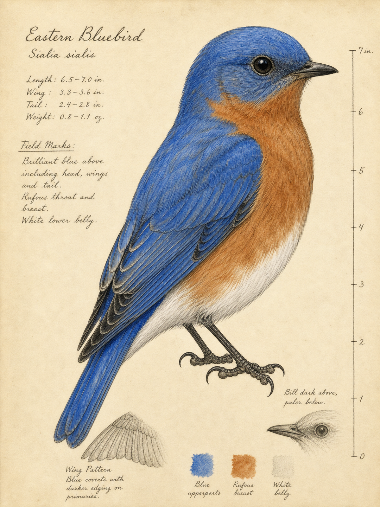
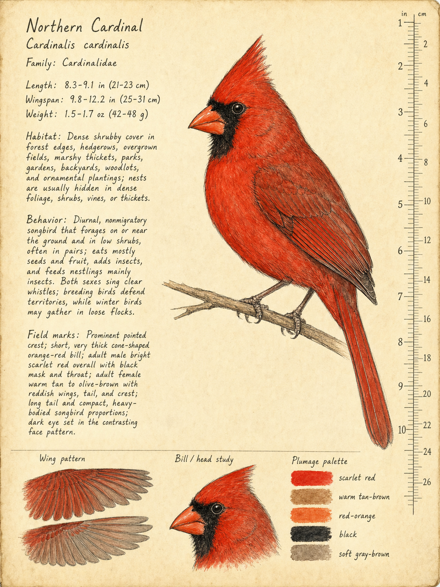
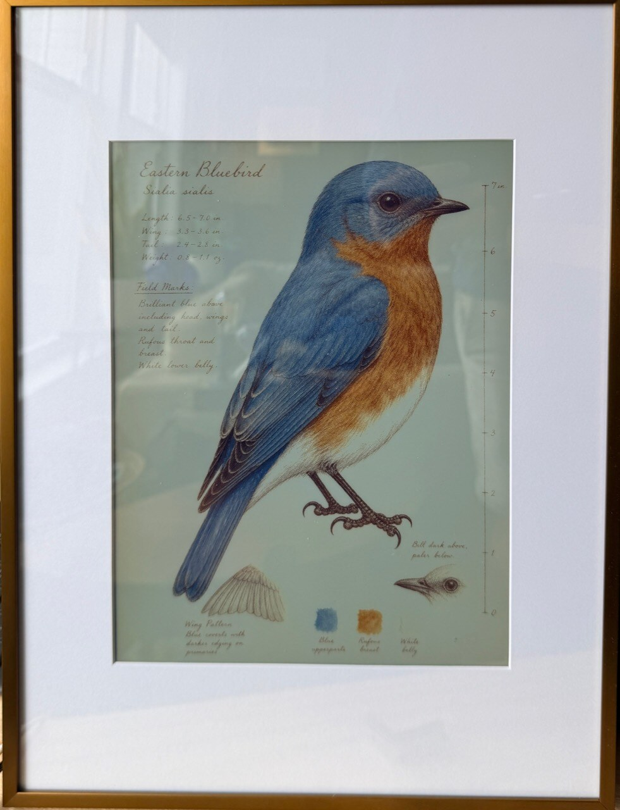
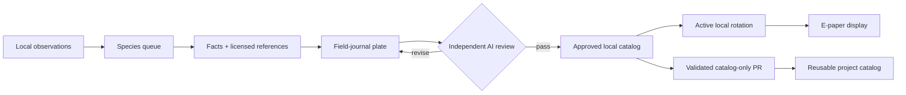

# Inky Bird Frame

Turn birds observed near you into a rotating collection of illustrated,
scientific field-journal plates on a color e-paper display.

<table>
  <tr>
    <td width="50%" align="center">
      
      <br><strong>Eastern Bluebird</strong> · <em>Sialia sialis</em>
    </td>
    <td width="50%" align="center">
      
      <br><strong>Northern Cardinal</strong> · <em>Cardinalis cardinalis</em>
    </td>
  </tr>
</table>

<p align="center">
  
  <br><em>A finished portrait installation using the recommended 12 x 16 inch frame with a panel-fitted mat opening.</em>
</p>

The frame follows public bird observations within a configurable distance and
rolling time window. When a new species appears, a controller researches it,
collects licensed reference photographs, creates a plate through Codex, and
subjects the result to an independent factual and visual review. Passing plates
join an immutable, reusable catalog. A lightweight Raspberry Pi rotates the
approved birds that are active in the installation's current observation
window.

## How it works



The system has two deliberately small roles:

- The **controller** refreshes observations, builds a private active catalog,
  downloads references, researches facts, generates and reviews candidates,
  and serves approved assets.
- The **display node** downloads approved assets, verifies their checksums, and
  rotates them on the Inky panel. It does no AI or discovery work.

Discovery location is private controller configuration. Approved plates and
manifests contain no ZIP code, coordinates, observation dates, local place
names, network details, or machine paths. A plate generated for one installation
can therefore be reused by every installation.

## Trust model

Generation is not treated as approval. For every candidate, a separate Codex
run:

1. independently verifies the profile against at least two authoritative
   sources;
2. compares anatomy, plumage, proportions, and field marks with every reference
   photograph;
3. checks scientific and common names, measurements, labels, and location
   neutrality; and
4. returns structured scores and concrete findings.

A failed review becomes corrective input for the next attempt. Attempts are
bounded by configuration, and exhausted work stops for inspection rather than
publishing. Once a taxon passes, it is never regenerated implicitly.

Deterministic code owns selection, licensing rules, checksums, dimensions,
rotation, publication, serving, and display state. Codex is limited to sourced
fact synthesis, illustration, and independent review.

## Hardware

The reference build uses two computers with distinct jobs. A Raspberry Pi Zero
2 W lives behind the frame and only displays approved images. A Raspberry Pi 4
or an existing macOS/Linux computer runs discovery, Codex generation and
review, catalog publication, and the HTTP service.

### Framed display

This is everything required to build the part that hangs on the wall.

| Part | Qty | Unit price | Extended | Purpose |
| --- | ---: | ---: | ---: | --- |
| [Pimoroni Inky Impression 13.3 inch (PIM774)](https://www.adafruit.com/product/6472) | 1 | $275.00 | $275.00 | Six-color, 1600x1200 e-paper display; mounting hardware and GPIO extension header are included |
| [Raspberry Pi Zero 2 W with pre-soldered header](https://www.pishop.us/product/raspberry-pi-zero-2w-with-headers/) | 1 | $20.75 | $20.75 | Compact Wi-Fi display node; no soldering required |
| [5V 2.5A Micro-USB power supply](https://www.adafruit.com/product/1995) | 1 | $8.25 | $8.25 | Powers the display node with a standard straight cable |
| [Official Raspberry Pi 64GB A2 microSD card](https://www.pishop.us/product/raspberry-pi-sd-card-64gb/) | 1 | $29.95 | $29.95 | Operating system and local image cache |
| [Golden State Art 12 x 16 inch bronze frame](https://www.amazon.com/gp/aw/d/B0C1Q5MYG9) | 1 | $24.99 | $24.99 | Portrait frame; the included 8 x 10.5 inch mat must be enlarged or replaced |
| **Framed display subtotal** |  |  | **$358.94** | Before tax and shipping |

The display's active area is approximately 7.98 x 10.65 inches. The included
8 x 10.5 inch mat masks part of that area and must not be used unchanged. Enlarge
it or order a custom mat with an opening of at least 8.1 x 10.75 inches, then
verify the opening against the physical panel before cutting. Test-fit the
display and Pi, trace their position on the supplied rear backing board, and cut
an opening that leaves the Pi, microSD card, and power connector accessible. The
Pi connects directly to the display and does not need a separate case. A
right-angle power cable is not required.

### Dedicated controller

An existing 64-bit macOS or Linux computer can run the controller at no
additional hardware cost. For a self-contained installation, the reference
controller is a Raspberry Pi 4 running 64-bit Ubuntu Server:

| Part | Qty | Unit price | Extended | Purpose |
| --- | ---: | ---: | ---: | --- |
| [Raspberry Pi 4 Model B, 4GB](https://www.adafruit.com/product/4296) | 1 | $120.00 | $120.00 | Runs discovery, Codex, review, catalog, and HTTP services |
| [Official Raspberry Pi 5.1V 3A USB-C power supply](https://www.adafruit.com/product/4298) | 1 | $8.74 | $8.74 | Controller power |
| [Flirc passive aluminum Raspberry Pi 4 case](https://www.adafruit.com/product/4553) | 1 | $14.95 | $14.95 | Silent enclosure and passive cooling |
| [Official Raspberry Pi 64GB A2 microSD card](https://www.pishop.us/product/raspberry-pi-sd-card-64gb/) | 1 | $29.95 | $29.95 | 64-bit OS, application, references, and generated assets |
| **Dedicated controller subtotal** |  |  | **$173.64** | Before tax and shipping |
| **Complete dedicated build** |  |  | **$532.58** | Framed display plus dedicated controller |

Reference prices were checked on July 9, 2026. Retail prices and availability
change; the totals exclude tax and shipping. A computer with a microSD reader
is needed to flash the two cards. No HDMI cable, keyboard, mouse, right-angle
cable, or display-node enclosure is required for normal operation.

The controller requires Python 3.11 or newer, Codex CLI authenticated with a
ChatGPT subscription, and network access to Codex, iNaturalist,
Zippopotam.us, and configured research sources. The display node requires
Python 3.11 or newer with Pimoroni's Inky package and network access to the
controller HTTP service.

The panel reports a `1600x1200` landscape canvas. Plates are authored at
`1200x1600` and rotated left for a portrait-mounted frame.

## Quick start

```bash
uv sync --extra dev --locked
cp config.example.toml config.toml
uv run inky-bird-frame discover --config config.toml
```

Set the private discovery ZIP, radius, rolling window, local paths, controller
URL, schedules, display geometry, and rotation policy in `config.toml`. The file
is ignored by Git and must remain private.

On the Pi, install the hardware extra into the Python environment that contains
the Pimoroni drivers:

```bash
python -m pip install -e '.[inky]'
```

## Operate

```bash
# Refresh observations and the private active catalog without invoking Codex.
uv run inky-bird-frame refresh --config config.toml

# Generate and AI-review missing plates from the latest refresh.
uv run inky-bird-frame generate --config config.toml

# Queue a broader one-time set without changing the active display window.
uv run inky-bird-frame seed --config config.toml --window last-year --species-limit 500

# Inspect approved, pending, and failed work.
uv run inky-bird-frame status --config config.toml

# Serve the catalog and rotate the next approved plate.
uv run inky-bird-frame serve --config config.toml
uv run inky-bird-frame display-cycle --config config.toml

# Preview or run owner-only publication into this repository's catalog.
uv run inky-bird-frame catalog-publish --config config.toml --dry-run
uv run inky-bird-frame catalog-publish --config config.toml
```

Observation windows are `last-day`, `last-week`, `last-30-days`, `last-year`,
and `all-time`. Discovery distance is configured in kilometers with `radius_km`.
Rotation modes are `sequential`, `shuffle`, and `weighted`. Shuffle visits every
active bird before repeating; weighted selection uses local observation counts
and avoids displaying the same bird twice in succession when alternatives are
available.
Recovery and operator-override commands are documented in
[`docs/operations.md`](docs/operations.md).

## Reusable catalog

Every approved species lives under `catalog/species/<taxon-id>-<slug>/`:

- `portrait.png`: location-neutral `1200x1600` source plate
- `display.png`: hardware-ready `1600x1200` image
- `manifest.json`: facts, research and review sources, reference provenance,
  quality scores, generation metadata, and SHA-256 checksums

Downloaded source photographs, run logs, pending work, rejected work, and
display state stay under ignored runtime storage. Reference licenses and source
URLs remain recorded without redistributing the source bitmaps.

Catalog publication is optional and independent of the live display. The
publisher accepts only new immutable taxa whose manifests, reviews, checksums,
image dimensions, and privacy constraints validate. A trusted controller opens
a catalog-only PR in this repository, verifies the exact staged paths, and uses
the authenticated repository owner's ruleset bypass to merge it. External PRs
and GitHub-hosted workflows never receive that credential.

## Development

```bash
uv sync --extra dev --locked
uv run ruff format --check .
uv run ruff check .
uv run mypy
uv run pytest
```

See [`docs/architecture.md`](docs/architecture.md),
[`docs/operations.md`](docs/operations.md),
[`docs/notifications.md`](docs/notifications.md), and
[`CONTRIBUTING.md`](CONTRIBUTING.md) for design, deployment, and contribution
details.
