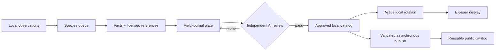

# Inky Bird Frame

Turn birds observed near you into a rotating collection of illustrated,
scientific field-journal plates on a color e-paper display.

<table>
  <tr>
    <td width="50%" align="center">
      
      <br><strong>Eastern Bluebird</strong> · <em>Sialia sialis</em>
    </td>
    <td width="50%" align="center">
      
      <br><strong>Northern Cardinal</strong> · <em>Cardinalis cardinalis</em>
    </td>
  </tr>
</table>

The frame follows public bird observations within a configurable distance and
rolling time window. When a new species appears, a controller researches it,
collects licensed reference photographs, creates a plate through Codex, and
subjects the result to an independent factual and visual review. Passing plates
join an immutable, reusable catalog. A lightweight Raspberry Pi rotates the
approved birds that are active in the installation's current observation
window.

## How it works



The system has two deliberately small roles:

- The **controller** refreshes observations, builds a private active catalog,
  downloads references, researches facts, generates and reviews candidates,
  and serves approved assets.
- The **display node** downloads approved assets, verifies their checksums, and
  rotates them on the Inky panel. It does no AI or discovery work.

Discovery location is private controller configuration. Approved plates and
manifests contain no ZIP code, coordinates, observation dates, local place
names, network details, or machine paths. A plate generated for one installation
can therefore be reused by every installation.

## Trust model

Generation is not treated as approval. For every candidate, a separate Codex
run:

1. independently verifies the profile against at least two authoritative
   sources;
2. compares anatomy, plumage, proportions, and field marks with every reference
   photograph;
3. checks scientific and common names, measurements, labels, and location
   neutrality; and
4. returns structured scores and concrete findings.

A failed review becomes corrective input for the next attempt. Attempts are
bounded by configuration, and exhausted work stops for inspection rather than
publishing. Once a taxon passes, it is never regenerated implicitly.

Deterministic code owns selection, licensing rules, checksums, dimensions,
rotation, publication, serving, and display state. Codex is limited to sourced
fact synthesis, illustration, and independent review.

## Hardware

Controller:

- macOS or Linux host with Python 3.11 or newer
- Codex CLI authenticated with a ChatGPT subscription
- network access to Codex, iNaturalist, Zippopotam.us, and research sources

Display node:

- Raspberry Pi capable of driving a Pimoroni Inky Impression Spectra 13.3
- storage, power supply, and network adapter appropriate for the chosen Pi
- Python 3.11 or newer with Pimoroni's Inky package available
- network access to the controller HTTP service

The panel reports a `1600x1200` landscape canvas. Plates are authored at
`1200x1600` and rotated left for a portrait-mounted frame.

## Quick start

```bash
uv sync --extra dev --locked
cp config.example.toml config.toml
uv run inky-bird-frame discover --config config.toml
```

Set the private discovery ZIP, radius, rolling window, local paths, controller
URL, schedules, display geometry, and rotation policy in `config.toml`. The file
is ignored by Git and must remain private.

On the Pi, install the hardware extra into the Python environment that contains
the Pimoroni drivers:

```bash
python -m pip install -e '.[inky]'
```

## Operate

```bash
# Refresh observations and the private active catalog without invoking Codex.
uv run inky-bird-frame refresh --config config.toml

# Generate and AI-review missing plates from the latest refresh.
uv run inky-bird-frame generate --config config.toml

# Inspect approved, pending, and failed work.
uv run inky-bird-frame status --config config.toml

# Serve the catalog and rotate the next approved plate.
uv run inky-bird-frame serve --config config.toml
uv run inky-bird-frame display-cycle --config config.toml

# Preview or run asynchronous publication to a dedicated public catalog.
uv run inky-bird-frame catalog-publish --config config.toml --dry-run
uv run inky-bird-frame catalog-publish --config config.toml
```

Observation windows are `last-day`, `last-week`, `last-30-days`, and
`all-time`. Discovery distance is configured in kilometers with `radius_km`.
Rotation modes are `sequential`, `shuffle`, and `weighted`. Shuffle visits every
active bird before repeating; weighted selection uses local observation counts
and avoids displaying the same bird twice in succession when alternatives are
available.
Recovery and operator-override commands are documented in
[`docs/operations.md`](docs/operations.md).

## Reusable catalog

Every approved species lives under `catalog/species/<taxon-id>-<slug>/`:

- `portrait.png`: location-neutral `1200x1600` source plate
- `display.png`: hardware-ready `1600x1200` image
- `manifest.json`: facts, research and review sources, reference provenance,
  quality scores, generation metadata, and SHA-256 checksums

Downloaded source photographs, run logs, pending work, rejected work, and
display state stay under ignored runtime storage. Reference licenses and source
URLs remain recorded without redistributing the source bitmaps.

Public catalog publication is optional and independent of the live display.
The publisher accepts only new immutable taxa whose manifests, reviews,
checksums, image dimensions, and privacy constraints validate. It pushes them
to a separately configured Git repository without routing generated content
through the application's code-review gates.

## Development

```bash
uv sync --extra dev --locked
uv run ruff format --check .
uv run ruff check .
uv run mypy
uv run pytest
```

See [`docs/architecture.md`](docs/architecture.md),
[`docs/operations.md`](docs/operations.md), and
[`CONTRIBUTING.md`](CONTRIBUTING.md) for design, deployment, and contribution
details.
