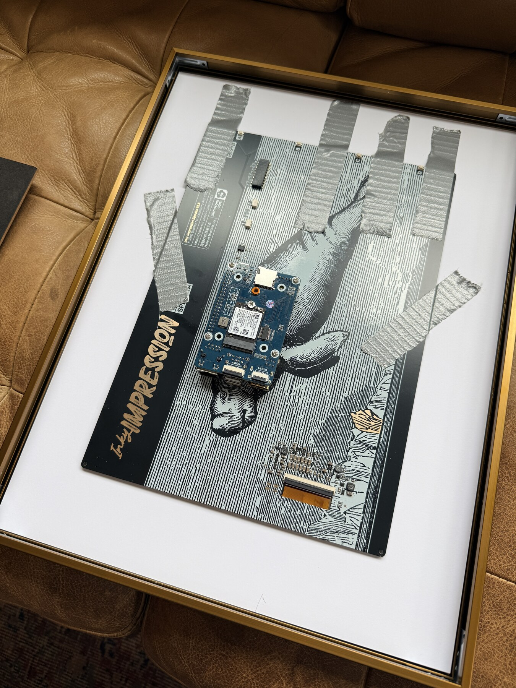
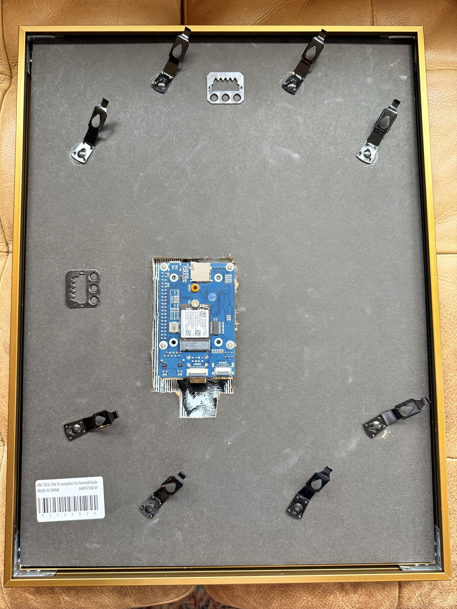
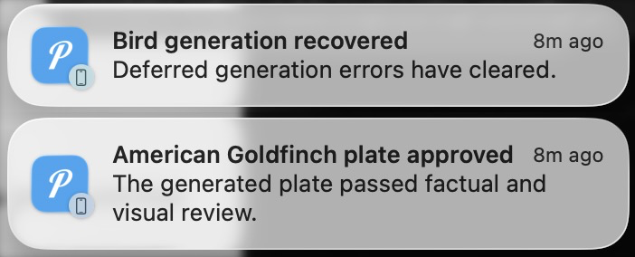

# Inky Bird Frame

Show birds recently observed or detected near you as illustrated field-journal
plates on a color e-paper display.

<table>
  <tr>
    <td width="50%" align="center">
      
      <br><strong>Eastern Bluebird</strong> · <em>Sialia sialis</em>
    </td>
    <td width="50%" align="center">
      
      <br><strong>Northern Cardinal</strong> · <em>Cardinalis cardinalis</em>
    </td>
  </tr>
</table>

<p align="center">
  
  <br><em>A finished portrait installation using the recommended 12 x 16 inch frame with a panel-fitted mat opening.</em>
</p>

The controller checks the observation sources you configure. iNaturalist and
eBird use your distance and time window; BirdWeather uses recent detections from
your station. If a matching plate already exists, the controller uses it. If
not, it gathers licensed reference photos, researches the species, creates a
plate with Codex, and reviews the result before it can appear on the frame.
Approved plates are cached and reused.

## How it works

<p align="center">
  <picture>
    <source media="(prefers-color-scheme: dark)" srcset="docs/images/installation-architecture-dark.png">
    
  </picture>
</p>

The project has two jobs:

- The **controller** checks observations, creates and reviews missing plates,
  and serves approved images on the private network.
- The **display node** downloads approved assets, verifies their checksums, and
  rotates them on the Inky panel. It never runs discovery or Codex.

The roles may run on one capable Raspberry Pi, but the recommended wall build
keeps the lightweight display node behind the frame and runs the controller on
an existing Mac, Linux computer, Raspberry Pi 4 or 5, or Docker host. A Pi Zero
2 W is a good display node, but it is not recommended for Codex generation.

Discovery location is private controller configuration. Approved plates and
manifests contain no postal code, coordinates, observation dates, local place
names, network details, or machine paths. A plate generated for one installation
can therefore be reused by every installation.

## How plates are approved

Creating an image does not approve it. A separate Codex run checks every
candidate:

1. independently verifies the profile against at least two authoritative
   sources;
2. compares anatomy, plumage, proportions, and field marks with every reference
   photograph;
3. checks scientific and common names, measurements, labels, and location
   neutrality; and
4. returns structured scores and concrete findings.

A failed review becomes corrective input for the next attempt. Attempts are
bounded by configuration, and exhausted work stops for inspection rather than
publishing. Once a taxon passes, it is never regenerated implicitly.

Regular application code handles selection, licensing rules, checksums, image
dimensions, rotation, publishing, downloads, and display state. Codex handles
sourced species research, illustration, and review.

## Hardware

The reference build uses two computers with distinct jobs. A Raspberry Pi Zero
2 W lives behind the frame and only displays approved images. A Raspberry Pi 4
or an existing macOS/Linux computer runs discovery, Codex generation and
review, catalog publication, and the HTTP service.

### Framed display

This is everything required to build the part that hangs on the wall.

| Part | Qty | Unit price | Extended | Purpose |
| --- | ---: | ---: | ---: | --- |
| [Pimoroni Inky Impression 13.3 inch (PIM774)](https://www.adafruit.com/product/6472) | 1 | $275.00 | $275.00 | Six-color, 1600x1200 e-paper display; mounting hardware and GPIO extension header are included |
| [Raspberry Pi Zero 2 W with pre-soldered header](https://www.pishop.us/product/raspberry-pi-zero-2w-with-headers/) | 1 | $20.75 | $20.75 | Compact Wi-Fi display node; no soldering required |
| [5V 2.5A Micro-USB power supply](https://www.adafruit.com/product/1995) | 1 | $8.25 | $8.25 | Powers the display node with a standard straight cable |
| [Official Raspberry Pi 64GB A2 microSD card](https://www.pishop.us/product/raspberry-pi-sd-card-64gb/) | 1 | $29.95 | $29.95 | Operating system and local image cache |
| [Golden State Art 12 x 16 inch bronze frame](https://www.amazon.com/gp/aw/d/B0C1Q5MYG9) | 1 | $24.99 | $24.99 | Portrait frame; the included 8 x 10.5 inch mat must be enlarged or replaced |
| **Framed display subtotal** |  |  | **$358.94** | Before tax and shipping |

The display's active area is approximately 7.98 x 10.65 inches. The included
8 x 10.5 inch mat masks part of that area and must not be used unchanged. Enlarge
it or order a custom mat with an opening of at least 8.1 x 10.75 inches, then
verify the opening against the physical panel before cutting. Test-fit the
display and Pi, trace their position on the supplied rear backing board, and cut
an opening that leaves the Pi, microSD card, and power connector accessible. The
Pi connects directly to the display and does not need a separate case. A
right-angle power cable is not required.

For a smaller build, substitute the supported 7.3-inch PIM773. Its active area
is approximately 6.30 x 3.78 inches and its board is approximately 6.86 x 4.85
inches. The display node fits each complete canonical plate onto its 800x480
canvas without cropping or stretching, leaving narrow paper-colored margins.
Choose and verify a frame and mat against the physical panel before cutting;
the 12 x 16 inch frame and dimensions above are specific to PIM774.

### A reuse-first build

The frame pictured below was built from parts already on hand: an Inky
Impression display, a Compute Module 4, and a Waveshare carrier board. The CM4
is larger and more powerful than the display role requires, but reusing it made
this build practical without buying another computer. This is one working
layout, not required hardware; the smaller Pi Zero 2 W above remains the
recommended display node for a new build.

<table>
<tr>
<td width="50%" align="center">

<br><strong>Before the backing board.</strong> Heavy-duty duct tape holds the panel securely while the display node remains accessible.
</td>
<td width="50%" align="center">

<br><strong>With the backing fitted.</strong> The supplied board was cut around the carrier so power, storage, and service access remain available.
</td>
</tr>
</table>

Whatever hardware you reuse, test-fit every layer before cutting the backing.
Avoid pressure on the e-paper panel, keep the display cable relaxed, and leave
connectors and ventilation unobstructed.

### Dedicated controller

An existing 64-bit macOS or Linux computer can run the controller at no
additional hardware cost. For a self-contained installation, the reference
controller is a Raspberry Pi 4 running 64-bit Ubuntu Server:

| Part | Qty | Unit price | Extended | Purpose |
| --- | ---: | ---: | ---: | --- |
| [Raspberry Pi 4 Model B, 4GB](https://www.adafruit.com/product/4296) | 1 | $120.00 | $120.00 | Runs discovery, Codex, review, catalog, and HTTP services |
| [Official Raspberry Pi 5.1V 3A USB-C power supply](https://www.adafruit.com/product/4298) | 1 | $8.74 | $8.74 | Controller power |
| [Flirc passive aluminum Raspberry Pi 4 case](https://www.adafruit.com/product/4553) | 1 | $14.95 | $14.95 | Silent enclosure and passive cooling |
| [Official Raspberry Pi 64GB A2 microSD card](https://www.pishop.us/product/raspberry-pi-sd-card-64gb/) | 1 | $29.95 | $29.95 | 64-bit OS, application, references, and generated assets |
| **Dedicated controller subtotal** |  |  | **$173.64** | Before tax and shipping |
| **Complete dedicated build** |  |  | **$532.58** | Framed display plus dedicated controller |

Reference prices were checked on July 9, 2026. Retail prices and availability
change; the totals exclude tax and shipping. A computer with a microSD reader
is needed to flash the two cards. No HDMI cable, keyboard, mouse, right-angle
cable, or display-node enclosure is required for normal operation.

The controller requires Python 3.11 or newer, Codex CLI authenticated with a
ChatGPT subscription, and network access to Codex, iNaturalist, optional eBird,
Zippopotam.us, and configured research sources. The display node requires
Python 3.11 or newer with Pimoroni's Inky package and network access to the
controller HTTP service.

PIM774 reports a `1600x1200` landscape canvas and PIM773 reports `800x480`.
Plates remain authored at `1200x1600` and stored as canonical `1600x1200`
display assets. The display node preserves PIM774 output and automatically fits
the complete plate onto PIM773 without cropping or stretching.

## Install

Start with the path that matches your controller:

- **Docker or a NAS:** use the [Docker controller guide](docs/docker.md). It
  downloads a small deployment bundle and pulls the published AMD64 or ARM64
  [GHCR image](https://github.com/veteranbv/inky-bird-frame/pkgs/container/inky-bird-frame).
  It does not build the project from source.
- **macOS, Ubuntu, or Raspberry Pi OS:** use the
  [native installation guide](docs/installation.md).

Both guides take you through the display Pi after the controller is healthy.
Installation follows five checkpoints:

1. prepare and diagnose the controller;
2. flash the display Pi and attach PIM773 or PIM774;
3. show the included Eastern Bluebird without Codex or a controller;
4. prove the Pi can reach the controller; and
5. enable live rotation and automatic generation.

Native setup previews its changes first. Repeat the command with `--yes` to
apply them, then run the matching doctor:

```bash
inky-bird-frame setup controller --config /path/to/config.toml
inky-bird-frame setup controller --config /path/to/config.toml --yes
inky-bird-frame doctor controller --config /path/to/config.toml

inky-bird-frame setup display --config /path/to/config.toml \
  --source-dir /path/to/inky-bird-frame \
  --venv "$HOME/.virtualenvs/pimoroni"
inky-bird-frame setup display --config /path/to/config.toml \
  --source-dir /path/to/inky-bird-frame \
  --venv "$HOME/.virtualenvs/pimoroni" --yes
inky-bird-frame doctor display --config /path/to/config.toml
```

## Operate

```bash
# Refresh observations and the private active catalog without invoking Codex.
uv run inky-bird-frame refresh --config config.toml

# Generate and review missing plates from the latest refresh.
uv run inky-bird-frame generate --config config.toml

# Queue a broader one-time set without changing the active display window.
uv run inky-bird-frame seed --config config.toml --source inaturalist \
  --window last-year --species-limit 500

# Queue species from one historical place and inclusive date range without
# changing the configured discovery location or active display window.
uv run inky-bird-frame seed --config config.toml --source inaturalist \
  --latitude 40.7128 --longitude -74.0060 --radius-km 11 \
  --start-date 2026-04-01 --end-date 2026-04-03 \
  --species-limit 500 --dry-run

# Inspect approved, pending, and failed work.
uv run inky-bird-frame status --config config.toml

# Serve the catalog and rotate the next approved plate.
uv run inky-bird-frame serve --config config.toml
uv run inky-bird-frame display-cycle --config config.toml

# Preview or run owner-only publication into this repository's catalog.
uv run inky-bird-frame catalog-publish --config config.toml --dry-run
uv run inky-bird-frame catalog-publish --config config.toml
```

Choose any combination of `inaturalist`, `ebird`, and `birdweather` in
`discovery.sources`. BirdWeather reads detection summaries from one station; it
does not receive recordings or manage microphones. Every provider result is
matched to the same iNaturalist species identity before it enters the catalog.

Choose `last-day`, `last-week`, `last-30-days`, `last-year`, or `all-time` for
the observation window. Provider limits still apply. The
[discovery guide](docs/discovery.md) explains credentials, merging, privacy,
and those limits.

Rotation modes are `sequential`, `shuffle`, `shuffle_bag`, and `weighted`.
`shuffle_bag` is the default: it shows every active bird once before starting a
new round, while adding newly discovered birds to the current round. See
[Operations](docs/operations.md) for every option and the recovery commands.

## Related project

Looking for a project that listens through a local microphone?
[AvianVisitors](https://github.com/Twarner491/AvianVisitors) by Teddy Warner
uses BirdNET-Pi and presents detected birds in a live illustrated collage. It
also supports Home Assistant, MQTT, remote access, eBird regional filtering,
optional e-ink hardware, BirdWeather, and complete kits. Inky Bird Frame focuses
on reusable field-journal plates and does not manage audio. Teddy's detailed
[AvianVisitors project write-up](https://theodore.net/projects/AvianVisitors/)
shows the complete listening-station workflow.

## Notifications

Notifications tell you when something worth seeing happens: a new bird appears,
a plate passes review, a failed service recovers, or a generation needs help.
Routine successes stay quiet. Delivery uses a retry queue, so a notification
provider outage does not block discovery or generation.



This example uses Pushover, but it is not required. The same configuration can
target Discord, ntfy, Gotify, Slack, email, Home Assistant, and other
Apprise-supported services. See [`docs/notifications.md`](docs/notifications.md)
for setup examples, event controls, retry behavior, and secret handling.

## Reusable catalog

Every approved species lives under `catalog/species/<taxon-id>-<slug>/`:

- `portrait.png`: location-neutral `1200x1600` source plate
- `display.png`: canonical `1600x1200` landscape image; PIM773 display nodes
  fit it locally to `800x480`
- `manifest.json`: facts, research and review sources, reference provenance,
  quality scores, generation metadata, and SHA-256 checksums
- `profile.json`: factual species profile matching the manifest, when produced
  by the current pipeline
- `quality-review.json`: sourced review matching the manifest, when produced by
  the current pipeline

Downloaded source photographs, run logs, pending work, rejected work, and
display state stay under ignored runtime storage. Reference licenses and source
URLs remain recorded without redistributing the source bitmaps.

Publishing to the shared catalog is optional and separate from the live frame.
The publisher accepts only new species that pass the catalog checks, opens a
catalog-only pull request, and verifies the exact files before merging it.
External pull requests and GitHub-hosted workflows never receive the private
controller's publication credentials.

## Contributing

Code, documentation, hardware support, and new catalog plates are welcome. The
repository includes structured templates for bug reports, feature proposals,
bird requests, and pull requests.

To contribute a plate generated by your own controller, prepare one approved
taxon and validate the resulting catalog:

```bash
uv run inky-bird-frame catalog prepare <taxon-id> \
  --source-catalog <approved-catalog> \
  --catalog catalog
uv run inky-bird-frame catalog validate --catalog catalog
```

Public CI verifies privacy, provenance, checksums, image structure, and that
catalog pull requests only add new immutable taxa. It does not receive Codex,
deployment, notification, or publisher credentials. See
[`CONTRIBUTING.md`](CONTRIBUTING.md) for the complete workflow and engineering
expectations, and [`SECURITY.md`](SECURITY.md) for private vulnerability
reporting.

## Development

```bash
uv sync --extra dev --locked
uv run ruff format --check .
uv run ruff check .
uv run mypy
uv run pytest
```

See [`docs/installation.md`](docs/installation.md),
[`docs/troubleshooting.md`](docs/troubleshooting.md),
[`docs/architecture.md`](docs/architecture.md),
[`docs/operations.md`](docs/operations.md),
[`docs/notifications.md`](docs/notifications.md), and
[`CONTRIBUTING.md`](CONTRIBUTING.md) for design, deployment, and contribution
details.
