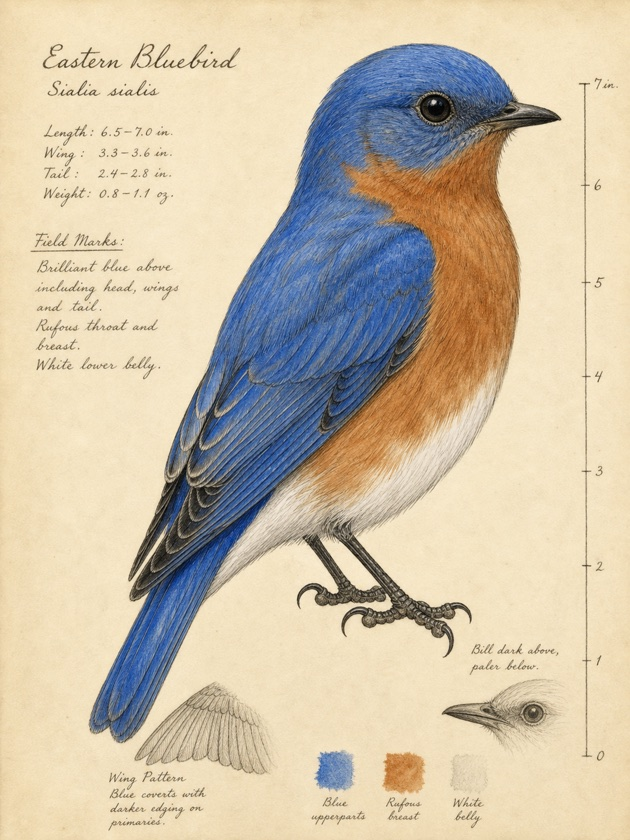
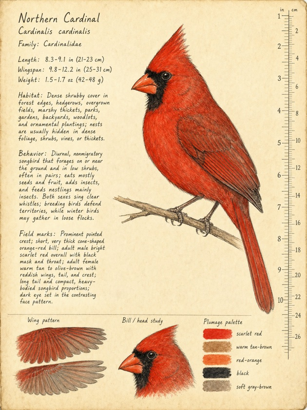
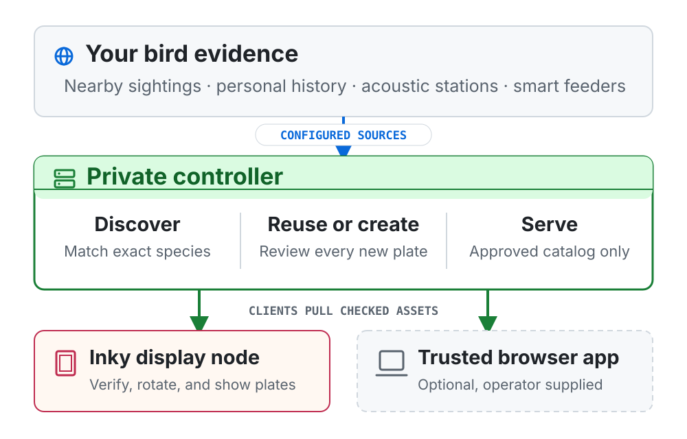

# Inky Bird Frame

Turn the birds around you, the birds your station hears, and the birds you have
seen into reviewed field-journal plates on a color e-paper frame.

[](https://github.com/veteranbv/inky-bird-frame/actions/workflows/ci.yml)
[](https://github.com/veteranbv/inky-bird-frame/releases/latest)
[](LICENSE)

<p align="center">
  
  <br><em>A finished portrait installation using the recommended 12 x 16 inch frame with a panel-fitted mat opening.</em>
</p>

I built Inky to keep birding present between outings. A feeder visit, a sound
outside, or a bird logged on a trip can become something beautiful on the wall
and something my family can learn from.

<p align="center">
  <a href="https://henrysowell.com/birds"><strong>Browse the plates</strong></a>
  ·
  <a href="docs/hardware.md"><strong>Build the frame</strong></a>
  ·
  <a href="docs/docker.md"><strong>Run with Docker</strong></a>
</p>

<table>
  <tr>
    <td width="50%" align="center">
      <a href="catalog/species/12942-eastern-bluebird/portrait.png"></a>
      <br><strong>Eastern Bluebird</strong> · <em>Sialia sialis</em>
    </td>
    <td width="50%" align="center">
      <a href="catalog/species/9083-northern-cardinal/portrait.png"></a>
      <br><strong>Northern Cardinal</strong> · <em>Cardinalis cardinalis</em>
    </td>
  </tr>
</table>

Inky brings several kinds of bird evidence into one private collection:

- nearby observations from iNaturalist and eBird;
- your own eBird history, including birds recorded on past trips;
- acoustic detections from BirdWeather, self-hosted BirdNET-Go, or BirdNET
  Analyzer; and
- authorized Bird Buddy feeder postcards and optional manual sightings.

The controller reuses an approved plate whenever one exists. For a missing
species, it gathers licensed references, researches the bird, creates the plate
with Codex, and runs a separate factual and visual review before the image can
appear. Your discovery location and observation history stay private.

## Start here

- **Build the complete wall frame:** choose parts in the
  [hardware guide](docs/hardware.md), then follow the
  [native installation](docs/installation.md).
- **Run the controller on Docker or a NAS:** use the
  [Docker controller guide](docs/docker.md).
- **Use an existing Mac, Linux host, or Raspberry Pi:** use the
  [native installation guide](docs/installation.md).
- **Connect eBird, BirdNET, Bird Buddy, or another source:** choose providers in
  the [discovery guide](docs/discovery.md).
- **Connect a trusted browser application:** read the
  [browser application boundary](docs/installation.md#browser-applications).
  Inky provides a read-only catalog and image interface, not a browser UI.
- **Request or contribute a bird:** start with
  [Contributing](CONTRIBUTING.md).

## How it works

<p align="center">
  <a href="docs/images/readme-overview.svg">
    <picture>
      <source media="(prefers-color-scheme: dark)" srcset="docs/images/readme-overview-dark.svg">
      
    </picture>
  </a>
  <br><em><a href="docs/images/readme-overview.svg">Open the full-size overview</a> on a small screen. The <a href="docs/installation.md">installation guide</a> includes the complete runtime and network diagram.</em>
</p>

The project has two installed roles:

- The **controller** checks configured sources, creates and reviews missing
  plates, and serves an approved catalog on a trusted private network.
- The **display node** downloads approved assets, verifies their checksums, and
  rotates them on the Inky panel. It never runs discovery or Codex.

A trusted browser application may also read the catalog through a same-origin
proxy or an explicitly allowed origin. Inky supplies the interface, not the
browser application. The controller has no built-in authentication or TLS and
must not be exposed directly to the internet.

The controller and display may run on one capable Raspberry Pi, but the
recommended wall build keeps a lightweight Pi behind the frame and runs the
controller on an existing Mac, Linux computer, Raspberry Pi 4 or 5, or Docker
host. A controller or network outage does not blank the e-paper panel; it keeps
showing its last successful image.

A same-origin application proxy is the recommended browser path. It can
authenticate users, keeps the controller on the trusted network, and needs no
CORS setting. Direct cross-origin access is disabled by default. Browser local
network and mixed-content policies vary, so a direct connection may prompt for
permission or fail even when its origin is allowed. Browser reads never count
as display-node health. Allowing an origin does not add authentication or make
the controller safe to expose to the internet. See
[Browser applications](docs/installation.md#browser-applications) for the
API, privacy, and network limits.

## Observation sources

- **Nearby public sightings: iNaturalist or eBird.** These use the configured
  point, radius, and supported time window.
- **Your sightings and trips: eBird Archive.** Inky imports the official
  **Download My Data** ZIP or CSV without storing account credentials, locations,
  comments, counts, or media references.
- **A live acoustic station: BirdWeather or BirdNET-Go.** Inky reads species
  summaries and never receives recordings or manages microphones.
- **Offline acoustic results: BirdNET Analyzer.** Only CSV history you
  explicitly import enters private controller state.
- **A smart feeder: Bird Buddy.** This opt-in private-API provider requires
  permission from Bird Buddy and an explicit authorization confirmation.

Providers run independently, so one failure does not stop healthy providers.
Every result must resolve to the same active iNaturalist bird species before it
can enter generation. BirdWeather, BirdNET-Go, and Bird Buddy can also give the
newest eligible detection one display turn before normal rotation resumes.

See [Discovery sources](docs/discovery.md) for credentials, provider limits,
privacy, setup, verification, failure handling, recovery, and disabling a
provider.

### Related project

If you want an end-to-end backyard listening station,
[AvianVisitors](https://github.com/Twarner491/AvianVisitors) by Teddy Warner is a
project I’m happy to point people toward. Built around BirdNET-Pi, it turns local
microphone detections into a live illustrated collage and connects with Home
Assistant, MQTT, remote access, and eBird regional filtering. Teddy also offers
hardware kits for the microphone and frame, and the optional e-ink frame can run
from either the local station or BirdWeather data. His detailed
[AvianVisitors project write-up](https://theodore.net/projects/AvianVisitors/)
is a great guide to the full listening-station workflow.

Inky Bird Frame meets that ecosystem at a different point. It can bring in
acoustic detections from BirdNET-Go, BirdWeather, and BirdNET Analyzer alongside
eBird, iNaturalist, Bird Buddy, and personal eBird history, then turn them into
reviewed, reusable field-journal plates. Inky does not record or analyze raw
audio, configure microphones, or install and manage a BirdNET detector.

## Plates you can trust and reuse

Creating an image does not approve it. A separate Codex run checks every
candidate:

1. independently verifies the species profile against at least two authoritative
   sources;
2. compares anatomy, plumage, proportions, and field marks with every reference
   photograph;
3. checks names, measurements, labels, and location neutrality; and
4. returns structured scores and concrete corrections.

A failed review edits the candidate with those corrections. Attempts are
bounded, and exhausted work stops for inspection rather than publishing. Regular
application code, not Codex, owns provider parsing, license rules, checksums,
dimensions, catalog state, downloads, and display rotation.

Approved plates and manifests contain no postal code, coordinates, observation
dates, local place names, network details, or machine paths. That separation
lets every installation reuse the same reviewed plate. Downloaded references,
private observations, run logs, rejected work, and display state stay outside
the reusable catalog.

[Browse the public gallery](https://henrysowell.com/birds) or read the
[architecture and privacy model](docs/architecture.md).

## Hardware

The reference display uses the 13.3-inch PIM774, a Pi Zero 2 W with a
pre-soldered header, and a 12 x 16 inch portrait frame. The supported 7.3-inch
PIM773 provides a smaller build; the display node fits the complete canonical
plate without cropping or stretching.

An existing 64-bit Mac or Linux computer can host the controller at no added
hardware cost. A dedicated Raspberry Pi 4 is optional. The reference prices
checked on July 9, 2026 put the framed PIM774 display at **$358.94** and the
optional dedicated controller at **$173.64**, before tax and shipping.

The [hardware guide](docs/hardware.md) contains the complete bill of materials,
panel and mat dimensions, assembly photographs, reuse guidance, and physical
safety notes. Verify every measurement against the panel before cutting a mat or
backing board.

## Install

Choose the path that matches the controller:

- **Docker or a NAS:** the [Docker controller guide](docs/docker.md) downloads a
  release bundle and pulls the published AMD64 or ARM64 image from
  [GitHub Container Registry](https://github.com/veteranbv/inky-bird-frame/pkgs/container/inky-bird-frame).
- **macOS, Ubuntu, or Raspberry Pi OS:** the
  [native installation guide](docs/installation.md) previews every managed setup
  change before applying it.

Both paths continue through the same five checkpoints: prepare and diagnose the
controller, flash and attach the display Pi, prove the panel with an included
plate, prove private-network access, then enable live rotation and automatic
generation.

The controller needs Python 3.11 or newer and either a ChatGPT plan that includes
Codex or separately billed OpenAI API access. It also needs network access to
the observation, geocoder, research, and Codex services you configure. The
display needs Pimoroni’s Inky package and private-network access to the
controller.

## Living with the frame

Normal installations schedule observation refresh, generation, catalog serving,
notifications, and display rotation. These commands are the useful first checks
on a native installation. They use the default managed runtime; if you chose a
different application directory, point `IBF` at its `.venv/bin/inky-bird-frame`
instead.

```bash
IBF="$HOME/Services/inky-bird-frame/.venv/bin/inky-bird-frame"
"$IBF" --version
"$IBF" doctor controller --config /path/to/config.toml
"$IBF" status --config /path/to/config.toml
"$IBF" refresh --config /path/to/config.toml
"$IBF" generate --config /path/to/config.toml
```

`shuffle_bag` is the default rotation: it shows every active bird once before a
new round and admits newly discovered birds into the current round. The active
catalog includes approved species that are currently observed or explicitly
kept in the private collection.

See [Operations](docs/operations.md) for Docker equivalents, historical seeding,
collection management, rotation modes, publication, backups, and failure
recovery. Start with [Troubleshooting](docs/troubleshooting.md) when a doctor
check fails.

## Notifications

Notifications tell you when something worth seeing happens: a new bird appears,
a plate passes review, a failed service recovers, or generation needs help.
Routine successes stay quiet. Delivery uses a retry queue, so a notification
provider outage does not block discovery or generation.


Pushover is one option. The same configuration can target Discord, ntfy, Gotify,
Slack, email, Home Assistant, and other Apprise-supported services. See
[Notifications](docs/notifications.md) for setup, event controls, retries, and
secret handling.

## Contributing

Code, documentation, hardware compatibility, and new catalog plates are welcome.

- [Request a bird](https://github.com/veteranbv/inky-bird-frame/issues/new?template=bird_request.yml)
- [Report a bug](https://github.com/veteranbv/inky-bird-frame/issues/new?template=bug_report.yml)
- [Propose a feature](https://github.com/veteranbv/inky-bird-frame/issues/new?template=feature_request.yml)
- [Report a problem with a published plate](https://github.com/veteranbv/inky-bird-frame/issues/new?template=plate_problem.yml)
- [Read the contribution guide](CONTRIBUTING.md)

Public CI checks privacy, provenance, checksums, image structure, and immutable
catalog rules. External pull requests never receive Codex, deployment,
notification, or publisher credentials.

The project does not offer individual setup support. Start with the doctor
commands and [troubleshooting guide](docs/troubleshooting.md); open a bug only
when you can describe reproducible incorrect behavior.

Thank you to [@dwalters0](https://github.com/dwalters0), whose contribution
identified and helped close the trusted browser-client gap, and to everyone who
shares an issue, plate, fix, or idea.

## Documentation

| If you need to… | Read… |
| --- | --- |
| Choose parts or assemble a frame | [Hardware](docs/hardware.md) |
| Install on macOS, Linux, or Raspberry Pi OS | [Native installation](docs/installation.md) |
| Run the controller with Docker or on a NAS | [Docker controller](docs/docker.md) |
| Configure observation and detection sources | [Discovery sources](docs/discovery.md) |
| Operate, seed, recover, update, or roll back | [Operations](docs/operations.md) |
| Back up or restore private controller state | [Backup and restore](docs/backup.md) |
| Configure alerts | [Notifications](docs/notifications.md) |
| Diagnose a failure | [Troubleshooting](docs/troubleshooting.md) |
| Understand trust, privacy, and data flow | [Architecture](docs/architecture.md) |
| Submit a change or plate | [Contributing](CONTRIBUTING.md) |
| Report a vulnerability privately | [Security](SECURITY.md) |

## Development

```bash
uv sync --extra dev --locked
uv run ruff format --check .
uv run ruff check .
uv run mypy
uv run pytest
uv run inky-bird-frame catalog validate --catalog catalog
```

## License

Inky Bird Frame is available under the [MIT License](LICENSE). The controller
container also includes Codex CLI and GitHub CLI. Their licenses and the exact
in-image notice paths are listed in
[`THIRD_PARTY_NOTICES.md`](THIRD_PARTY_NOTICES.md).
