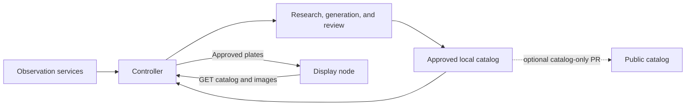

# Architecture

Inky Bird Frame has three roles. The controller discovers birds and creates
plates. The display node pulls approved images. An optional publisher sends new
plates to a shared GitHub catalog.

## Roles

### Controller

The controller owns discovery and generation through independent schedules.
An observation refresh:

1. resolves the private discovery location;
2. queries each explicitly configured observation provider independently;
3. exact-matches external taxonomy to canonical iNaturalist species IDs;
4. atomically stores the private observation snapshot; and
5. publishes a private active catalog containing only observed taxa that
   already have approved plates.

A locked generation cycle reads the latest non-stale snapshot and the durable
seed queue. Current observations take priority over queued seed taxa. The cycle
then:

1. selects taxa without a terminal local state;
2. acquires and verifies licensed references;
3. creates a sourced, structured species profile through Codex;
4. generates a plate through the built-in `$imagegen` skill;
5. prepares portrait and display assets;
6. runs an independent, sourced Codex factual and visual review;
7. regenerates failed reviews with corrective findings, within a configured
   attempt limit;
8. atomically publishes passing output through the pending queue; and
9. immediately rebuilds the private active catalog from the latest observation
   snapshot.

Transient per-taxon failures are written to a durable retry schedule with capped
exponential backoff. Deferred taxa are skipped without consuming the successful
generation quota, and the cycle scans later work up to a separate configured
attempt cap. Shared catalog or state corruption still fails closed.

Notification delivery is an independent durable outbox. Application state is
committed first, each destination is acknowledged separately, and provider
failures never block controller or display work.

The controller also exposes a read-only HTTP catalog:

- `GET /health`
- `GET /v1/catalog`
- `GET /v1/assets/<catalog-relative-path>`

`/health` reports approved and active species counts from the last built
catalog index and never rebuilds it, so a health check answers cheaply at any
catalog size. The server also records the time of the last `/v1/catalog`
fetch in `display-last-fetch.json` and of the last display-reported completed
update (`GET /v1/display-success`) in `display-last-success.json`, both under
`state_dir`; the notifications cycle uses them to raise the display-staleness
events described in
[`notifications.md`](notifications.md#events-and-noise-controls).

Native installations use launchd or systemd to schedule the controller's
one-shot commands. Generated systemd serve and display units carry basic
sandboxing directives such as `NoNewPrivileges` and `PrivateTmp`. Docker
installations run the same commands through one
serial scheduler process. A scheduler job failure is isolated to that job and
its next interval; generation remains disabled after scheduler startup until a
refresh succeeds. The HTTP server runs without Codex or GitHub authentication,
while the scheduler receives only the persistent credential volumes needed for
enabled work.

### Display node

The display node does not discover birds or generate art. Each timer cycle:

1. fetches the private active catalog;
2. selects an entry using the configured sequential, shuffle, `shuffle_bag`, or
   observation-weighted policy and durable local state. A newer BirdWeather
   station detection may take priority once and counts as shown in the current
   rotation. `shuffle_bag` keeps its own remaining and shown lists, so a newly
   active species joins the current bag without restoring species already
   shown;
3. downloads the canonical display asset;
4. verifies its SHA-256 checksum;
5. writes it to a local cache atomically;
6. fits it without cropping when the detected panel uses the 800x480 geometry;
   and
7. updates the Inky panel before advancing state.

Display cycles use a nonblocking local process lock. A cycle that cannot obtain
the lock fails without changing state, and failed panel updates also leave the
prior selection state intact.

This pull model keeps display addressing out of controller state and limits the
node to a read-only catalog relationship. If refresh, generation, or controller
access fails, the current e-paper image remains visible.

The controller records one aggregate display fetch heartbeat and one aggregate
successful-update heartbeat. The supported topology is therefore one active
display node per controller; per-panel health for multiple simultaneous nodes
would require a separate identity and monitoring design.

### Catalog publisher

Catalog archival is an independent scheduled role. It never runs in the
generation transaction and cannot delay local approval or display rotation. A
publication cycle:

1. verifies that GitHub CLI is authenticated as the configured repository owner;
2. fetches the configured base branch of this project repository;
3. creates a disposable detached worktree from that exact remote revision;
4. validates every local and repository species directory;
5. copies only taxa that do not yet exist in `catalog/`;
6. rebuilds and validates the catalog index;
7. verifies that the staged diff contains only the index and new species files;
8. pushes a content-addressed publication branch;
9. opens a catalog-only pull request; and
10. owner-merges it with `gh pr merge --admin` and an exact head-SHA guard.

Validation fails closed on review scores, missing verification sources,
unbounded current-generation output, unexpected files, image dimensions or
metadata, checksums, private configuration fields, local paths, and any attempt
to change an existing catalog taxon. Explicitly recognized seed and version-one
catalog entries remain publishable for backward compatibility. A failed fetch,
validation, commit, PR, or merge leaves the local catalog and active display
unchanged. The next scheduled cycle retries from the current remote branch.

## State model

| State | Meaning | Automatic generation allowed |
| --- | --- | --- |
| approved | Independent Codex review passed; published immutably | No |
| pending | Passing candidate awaiting atomic publication or crash recovery | No |
| rejected | Operator override rejected a candidate | No |
| failed | Generation exhausted its bounded attempts | No |
| queued | Broader seed discovery awaits generation | Yes |
| eligible | No terminal state exists | Yes |

`retry TAXON_ID` archives rejected or failed state and makes that taxon
eligible. Approved art is never replaced implicitly.

## Privacy and licensing

The private discovery location and observation window influence the generation queue and
active rotation. They are not passed to image generation and are not stored in
catalog manifests. Observation snapshots and counts stay in ignored
controller state.

Reference acquisition accepts only iNaturalist research-grade photos marked
CC0 or CC BY, uses distinct observers, records attribution and source URLs, and
requires an 800-pixel minimum edge. Outbound fetches accept only HTTP(S) URLs
and enforce a bounded response size. Reference bitmaps stay in ignored
controller state and are not redistributed in the catalog.

## Deterministic and generative work

Regular application code handles discovery parameters, the seed queue,
terminal-state selection, license filtering, reference checksums, prompt
assembly, image dimensions, catalog checksums, local approval, publication,
downloads, and display rotation.

Codex handles factual synthesis, image generation, and independent factual and
visual review. Those steps are bounded by structured schemas, attached
references, sourced verification, versioned prompts, configurable attempts,
and a terminal failure state. Human approval is not required for normal flow.

Application code and documentation continue through protected pull requests.
Generated species are content artifacts: after runtime review and deterministic
validation, the trusted controller submits and owner-merges a catalog-only PR in
this repository. This keeps external contributors and untrusted GitHub-hosted
workflows out of the publication credential path without making human review a
content bottleneck.
