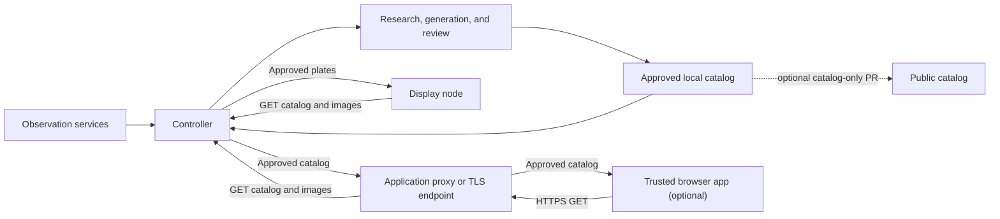

# Architecture

Inky Bird Frame has three roles. The controller discovers birds and creates
plates. The display node pulls approved images. An optional publisher sends new
plates to a shared GitHub catalog. A trusted browser application can also read
the active catalog through a same-origin proxy or, for direct cross-origin
access, after the operator allows its exact origin. Inky provides that read-only
interface but does not include the browser application.

```mermaid
flowchart LR
    S["Observation services"] --> C["Controller"]
    C --> R["Research, generation, and review"]
    R --> A["Approved local catalog"]
    A --> C
    D["Display node"] -- "GET catalog and images" --> C
    C -- "Approved plates" --> D
    B["Trusted browser app (optional)"] -- "HTTPS GET" --> X["Application proxy or TLS endpoint"]
    X -- "GET catalog and images" --> C
    C -- "Approved catalog" --> X
    X -- "Approved catalog" --> B
    A -. "optional catalog-only PR" .-> P["Public catalog"]
```

## Design principles

- **Private evidence, reusable art.** Locations, observation history,
  credentials, and work records stay in controller state. Approved plates stay
  location-neutral so every installation can reuse them.
- **Reuse before generation.** The controller checks the approved catalog
  before spending generation work on a missing species.
- **Deterministic safety around generative work.** Typed parsing, taxonomy,
  licensing, dimensions, checksums, publishing, and display behavior remain in
  application code. Codex creates and independently reviews candidate content.
- **Isolated external boundaries.** One provider, notification destination, or
  publisher failure must not stop healthy discovery sources or erase the last
  good display state.
- **Pull-only display.** The display reads approved assets and never receives
  controller credentials or runs discovery and generation.
- **Explicit opt-in.** Private imports, unsupported APIs, publication, browser
  origins, and notifications do nothing until the operator enables them.
- **Small supported topology.** One controller and one active display are the
  monitored contract. Broader deployments need explicit identity and health
  semantics rather than an accidental extension.

## Roles

### Controller

The controller owns discovery and generation through independent schedules.
An observation refresh:

1. resolves the private discovery location;
2. queries each explicitly configured observation provider independently;
3. exact-matches external taxonomy to canonical iNaturalist species IDs;
4. atomically stores the private observation snapshot; and
5. publishes a private active catalog containing approved taxa that are either
   observed now or retained in the private local collection.

The collection is a private, schema-versioned membership set. It stores only a
taxon ID, the initial membership origin, and a timestamp. A historical `seed`
adds every discovered taxon to this set while separately queueing missing
plates. `collection import-approved` is the explicit migration and trust step
for an existing catalog; later catalog synchronization does not mutate the
collection. The first seed, collection mutation, or generation cycle imports
any pre-collection seed-queue taxa and records a one-time migration timestamp.
This happens before pending approvals and prevents a later cycle from undoing
an explicit collection removal.

An authorized Bird Buddy provider keeps two additional private files under
`state_dir`. `birdbuddy-auth.json` contains the user's authorization
attestation, selected feeder, and rotating refresh token; the email, password,
and short-lived access token are never stored. `birdbuddy-detections.json`
deduplicates postcard species for 366 days, retains older all-time totals, and
keeps the newest confirmed metadata evidence for each species and provenance.
Private media identifiers link complete confirmed records back to cached
postcards so corrections replace preview classifications without downloading
media. After the 366-day detail window, a compact correction ledger remains
only while the corresponding confirmed media remains visible; it can update
archived totals without retaining the postcard ID.
Confirmed evidence closes the transient-feed gap without counting several
media files as several visits. Account-level manual evidence affects discovery
only when `birdbuddy_include_manual_sightings` is enabled. Both files use atomic
mode-`0600` writes and never enter the served or published catalog.

A self-hosted BirdNET-Go provider makes one bounded, read-only species-summary
request per refresh. The server's detection policy and false-positive state are
authoritative; the controller then applies the same exact iNaturalist Aves
taxonomy boundary as every external provider. Its base URL remains private
configuration, and neither that URL nor detection times enter the reusable
catalog.

BirdNET Analyzer imports use `birdnet-analyzer-detections.json` under
`state_dir`. The private mode-`0600` file stores a one-way recording-segment
fingerprint, species names, and an optional operator-supplied date. It never
stores source paths, offsets, confidence values, or audio. Reimports update a
segment's classification atomically; date-window discovery excludes undated
segments rather than inventing observation times.

eBird Archive imports use `ebird-archive-observations.json` under `state_dir`.
The complete-snapshot state retains one-way checklist fingerprints, calendar
dates, and species identity only. Account details, raw checklist and location
identifiers, coordinates, counts, comments, effort, and media metadata are
discarded during import. A mode-`0600` atomic replacement occurs only after the
entire export validates; a missing previously imported checklist fails closed
unless the operator explicitly permits history reduction.

A locked generation cycle completes that migration, recovers passing pending
work, and then passes the latest non-stale snapshot, durable queue, retry
schedule, approvals, and terminal states through the same side-effect-free work
calculation exposed by `status`. Current observations take priority over queued
taxa, and retry-due candidates are actionable. The cycle then:

1. selects taxa without a terminal local state;
2. acquires and verifies licensed references;
3. creates a sourced, structured species profile through Codex;
4. generates a plate through the built-in `$imagegen` skill;
5. prepares portrait and display assets;
6. runs an independent, sourced Codex factual and visual review;
7. edits failed plates with actionable corrective findings, within a configured
   attempt limit;
8. atomically publishes passing output through the pending queue; and
9. immediately rebuilds the private active catalog from the latest observation
   snapshot plus collection membership.

For active taxa present in the observation snapshot, provider count and latest
detection metadata override the location-neutral catalog entry. Collection-only
taxa omit observation metadata. This preserves active-catalog schema version 1
and gives weighted rotation its existing neutral fallback weight without
inventing evidence.

Plate rulers are vertical schematic body-length keys: they show the sourced
range and units, are labeled as not to scale, remain separate from the specimen,
and never claim that display pixels reproduce physical size. Range rulers span
only the published endpoints, increase bottom-to-top, and use four unlabeled
interior ticks as proportional subdivisions; they do not add a zero-based axis
or a second range marker. Independent review checks the same contract.

Species field marks that depend on relative anatomy are reference-matched rather
than reduced to a binary direction check. Generation and review compare the
base-to-tip relationship against the clearest attached side-profile references
and require consistent proportions across the primary specimen and anatomical
studies without encoding an arbitrary universal ratio.

Transient per-taxon failures are written to a durable retry schedule with capped
exponential backoff. Each record retains the species identity needed for an
explicit retry even when failure occurs before profile creation and the original
observation later expires. Deferred taxa are skipped without consuming the
successful generation quota, and the cycle scans later work up to a separate
configured attempt cap. Shared catalog or state corruption still fails closed.

Notification delivery is an independent durable outbox. Application state is
committed first, each destination is acknowledged separately, and provider
failures never block controller or display work.

The controller exposes a small HTTP interface:

- `GET /health`: service state, catalog counts, and application version
- `GET /v1/catalog`
- `GET /v1/assets/<active-image-path>`
- `POST /v1/display-fetch`
- `POST /v1/display-success`

Cross-origin browser access to the catalog and assets is disabled unless the
operator configures exact trusted origins. The server echoes a matching origin
and varies cache entries by `Origin`; it never enables credentialed browser
requests or grants wildcard access. Health and display telemetry responses are
served without cross-origin access headers. Ordinary catalog and browser reads
never update physical-display health.

Catalog schema version 1 has three top-level fields: `schema_version`,
`generated_at`, and `species`. Each species entry contains `taxon_id`,
`common_name`, `scientific_name`, `slug`, `portrait_path`, `portrait_sha256`,
`display_path`, `display_sha256`, and `approved_at`. `observation_count` and
`latest_detection_at` are optional. The server projects only these fields from
private controller state. It never exposes provider names, raw observations,
locations, credentials, or private provider state.

The asset route serves only portrait and display PNG paths present in the
current active catalog. It verifies each file against the catalog SHA-256 before
sending bytes. Catalog responses use `no-store`; an image request becomes
immutable-cacheable only when its `sha256` query matches the verified active
catalog digest. Catalog JSON and image responses carry
`X-Content-Type-Options: nosniff`.

Schema version 1 may gain an optional field only after a privacy review.
Removing a required field, changing a field's meaning or type, or exposing a
different data class requires a new schema version or route. Display nodes
reject an unsupported schema version and ignore unknown entry fields.

`/health` reads the approved count from the last built catalog index and the
active count from current active-catalog state. It never rebuilds or scans the
catalog, so the check stays cheap at any catalog size. Its additive `version`
field comes from installed package metadata.

After a display node parses the catalog, it posts the fixed JSON payload
`{"schema_version": 1}` to `/v1/display-fetch`. It posts the same bounded
payload to `/v1/display-success` only after a verified panel update. The server
records those times under `state_dir`, and the notifications cycle uses them to
raise the display-staleness events described in
[`notifications.md`](notifications.md#events-and-noise-controls). The POST
routes reject browser `Origin` headers and do not grant CORS access.

Display telemetry is not authenticated separately from the trusted-network
service. A client that can reach the controller can deliberately imitate a
display node's POST and refresh the aggregate signal. Keep the controller port
private and do not use these heartbeats as an identity or authorization check.

For one compatibility release, older display nodes may still use `GET
/v1/catalog?reports_success=1` and `GET /v1/display-success`. The controller
requires both the fixed Inky display user agent and no `Origin` header; current
display nodes fall back to these routes only when a telemetry POST fails. These
state-changing GET forms are deprecated and will be removed in the next feature
release. The service logs each request locally with source IP address, path and
query, and status. It does not log headers or send external browser telemetry.

Native installations use launchd or systemd to schedule the controller's
one-shot commands. Generated systemd serve and display units carry basic
sandboxing directives such as `NoNewPrivileges` and `PrivateTmp`. Docker
installations run the same commands through one
serial scheduler process. A scheduler job failure is isolated to that job and
its next interval; generation remains disabled after scheduler startup until a
refresh succeeds. The HTTP server runs without Codex or GitHub authentication,
while the scheduler receives only the persistent credential volumes needed for
enabled work.

### Display node

The display node does not discover birds or generate art. Each timer cycle:

1. fetches and validates the private active catalog, then reports that fetch;
2. selects an entry using the configured sequential, shuffle, `shuffle_bag`, or
   observation-weighted policy and durable local state. The newest BirdWeather,
   BirdNET-Go, or Bird Buddy detection may take priority once and counts as
   shown in the current rotation. `shuffle_bag` keeps its own remaining and
   shown lists, so a newly active species joins the current bag without
   restoring species already shown;
3. downloads the canonical display asset;
4. verifies its SHA-256 checksum;
5. writes it to a local cache atomically;
6. fits it without cropping when the detected panel uses the 800x480 geometry;
   and
7. updates the Inky panel before advancing state and reporting success.

Display cycles use a nonblocking local process lock. A cycle that cannot obtain
the lock fails without changing state, and failed panel updates also leave the
prior selection state intact.

This pull model keeps display addressing out of controller state and limits the
node to a read-only catalog relationship. If refresh, generation, or controller
access fails, the current e-paper image remains visible.

The controller records one aggregate display fetch heartbeat and one aggregate
successful-update heartbeat. The supported topology is therefore one active
display node per controller; per-panel health for multiple simultaneous nodes
would require a separate identity and monitoring design.

### Catalog publisher

Catalog archival is an independent scheduled role. It never runs in the
generation transaction and cannot delay local approval or display rotation. A
publication cycle:

1. verifies that GitHub CLI is authenticated as the configured repository owner;
2. fetches the configured base branch of this project repository;
3. creates a disposable detached worktree from that exact remote revision;
4. validates every local and repository species directory;
5. copies only taxa that do not yet exist in `catalog/`;
6. rebuilds and validates the catalog index;
7. verifies that the staged diff contains only the index and new species files;
8. pushes a content-addressed publication branch;
9. opens a catalog-only pull request; and
10. owner-merges it with `gh pr merge --admin` and an exact head-SHA guard.

Validation fails closed on review scores, missing verification sources,
unbounded current-generation output, unexpected files, image dimensions or
metadata, checksums, private configuration fields, local paths, and any attempt
to change an existing catalog taxon. Explicitly recognized seed and version-one
catalog entries remain publishable for backward compatibility. A failed fetch,
validation, commit, PR, or merge leaves the local catalog and active display
unchanged. The next scheduled cycle retries from the current remote branch.

## State model

| State | Meaning | Automatic generation allowed |
| --- | --- | --- |
| approved | Independent Codex review passed; published immutably | No |
| pending | Passing candidate awaiting atomic publication or crash recovery | No |
| incomplete pending | Interrupted candidate directory without a manifest | No |
| rejected | Operator override rejected a candidate | No |
| failed | Generation exhausted its bounded attempts | No |
| queued | Broader seed discovery awaits generation | Yes |
| terminal-blocked | A queued taxon also has incomplete pending, rejected, or failed state | No |
| eligible | No terminal state exists | Yes |

`retry TAXON_ID` archives incomplete pending, rejected, or failed state and
makes that taxon eligible. A validated identity recovered from retained state is
also added to the generation queue, so eligibility survives the original
observation window. For failed quality reviews, retry retains the final
actionable corrections as durable input to the first new generation attempt
while preserving cached research and references. Add `--refresh-research` when
those inputs themselves need to be replaced. Invalid approval debris is archived
and removed from the local index and active catalog before regeneration; a fully
valid approved entry remains protected. `retry TAXON_ID --source-attempt N` additionally
selects a retained portrait as the edit base. The archive-relative source path
stays in private retry state, and the passing manifest records its SHA-256 for
provenance. `retry TAXON_ID --source-run RUN_NAME --source-attempt N` selects a
specific attempt from an older archived failed run after validating archive
containment, the profile identity, failed review, and portrait. The archived run stays
immutable while its relative portrait path becomes the private correction
source. A repeatable `--correction "..."` on a source-selected retry replaces
the current automated correction list after operator adjudication. It does not
remove earlier human invariants, bypass source validation, or alter provenance.
`retry TAXON_ID --source-candidate ARCHIVE_NAME` reuses a complete,
human-rejected candidate that is already in the private archive. The command
validates archive containment, manifest identity, rejected status, human
rejection guidance, and portrait integrity before preserving it as the edit
source. After explicit human review,
`retry TAXON_ID --replace-approved --reason "..."` withdraws a locally approved
plate, preserves its rejection audit, rebuilds the local index, requeues the
taxon, preserves validated research and references, and starts a source-free
replacement constrained by the human rejection reason on every correction
attempt. Use `--refresh-research` if the cached factual inputs are also being
rejected. The migration is resumable after a partial failure. The public catalog
remains add-only; replacing a published artifact
requires a separate explicit migration and maintainer review. Approved art is
never replaced implicitly.

## Privacy and licensing

The private discovery location and observation window influence the generation
queue and active rotation. They are not passed to image generation and are not
stored in catalog manifests. Observation snapshots and counts stay in ignored
controller state. Collection state records taxon membership only; it never
stores locations, raw observations, or provider counts.

Reference acquisition accepts only iNaturalist research-grade photos marked
CC0 or CC BY, uses distinct observers, records attribution and source URLs, and
requires an 800-pixel minimum edge. Outbound fetches accept only HTTP(S) URLs
and enforce a bounded response size. Reference bitmaps stay in ignored
controller state and are not redistributed in the catalog.

## Deterministic and generative work

Regular application code handles discovery parameters, the seed queue,
terminal-state selection, license filtering, reference checksums, prompt
assembly, image dimensions, catalog checksums, local approval, publication,
downloads, and display rotation.

Codex handles factual synthesis, image generation, and independent factual and
visual review. Those steps are bounded by structured schemas, attached
references, sourced verification, versioned prompts, configurable attempts,
and a terminal failure state. A structured profile conflict can trigger one
fresh research pass, but reviewer prose is never written into the canonical
profile directly. Earlier corrections are carried forward as non-regression
constraints only when the reviewer explicitly marks the exact
earlier request as resolved; reversed or refined corrections remain actionable
instead of becoming contradictory invariants. Human approval is not required
for normal flow.

Application code and documentation continue through protected pull requests.
Generated species are content artifacts: after runtime review and deterministic
validation, the trusted controller submits and owner-merges a catalog-only PR in
this repository. This keeps external contributors and untrusted GitHub-hosted
workflows out of the publication credential path without making human review a
content bottleneck.
