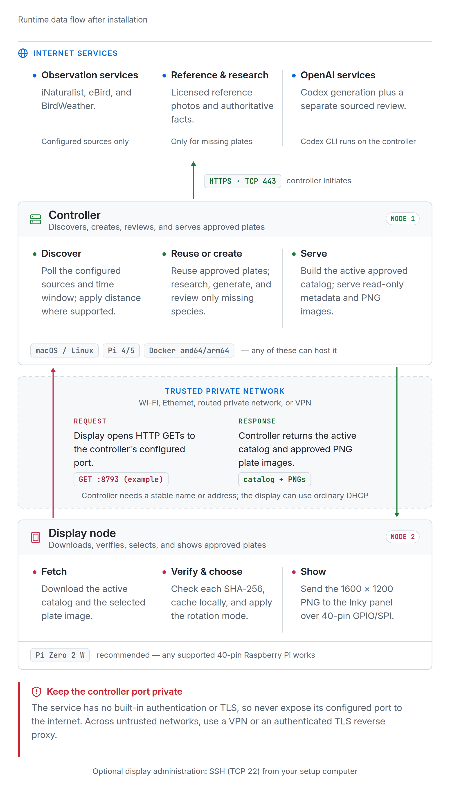
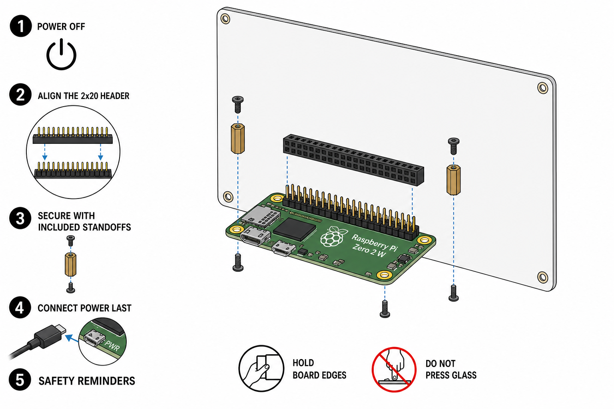

# Installation

This guide starts with a blank controller and Raspberry Pi and ends with a frame
that returns after a reboot. Follow the sections in order. The first panel test
uses an included plate, so you can prove the hardware before setting up Codex or
bird observations.

<picture>
  <source media="(prefers-color-scheme: dark)" srcset="images/installation-architecture-dark.png">
  
</picture>

The display initiates every application connection. The controller's configured
port (8793 in the supplied example configuration) must remain on a trusted
network and must not be forwarded from the public internet.

## Choose the two computers

The controller and display node have different jobs. A capable Linux Raspberry
Pi can run both, but the recommended framed build puts a small Pi behind the
display and runs the controller elsewhere. The controller can also run on an
existing Docker host; follow the
[Docker controller guide](docker.md) instead of either native controller
section.

| Role | Recommended | Supported | Notes |
| --- | --- | --- | --- |
| Controller | Existing Apple silicon Mac or Ubuntu Server 24.04 LTS computer | macOS with launchd; 64-bit Ubuntu 24.04 with systemd; 64-bit Raspberry Pi OS Bookworm or later with systemd | A Raspberry Pi 4 with 4GB is the smallest recommended dedicated controller. Docker installation is documented separately. |
| Display | Raspberry Pi Zero 2 W with pre-soldered 40-pin header and Raspberry Pi OS Lite 64-bit | Raspberry Pi OS Bookworm or later on a 40-pin Raspberry Pi | This release supports the Pimoroni Inky Impression 13.3 inch PIM774 at 1600x1200. |

The setup command detects launchd or systemd, but detection does not mean every
operating system has been tested. Other systems may work. Contributions that
document and test them are welcome.

Pimoroni lists PIM774 as compatible with every 40-pin Raspberry Pi, including
Zero variants. A Zero without a header requires soldering. The Zero 2 W has a
64-bit processor and built-in 2.4 GHz Wi-Fi. See the
[PIM774 product page](https://shop.pimoroni.com/products/inky-impression) and
[Raspberry Pi Zero 2 W specifications](https://www.raspberrypi.com/products/raspberry-pi-zero-2-w/).

## Before you begin

You need:

- the framed-display parts in the [README bill of materials](../README.md#framed-display);
- one controller from the support table;
- a computer with a microSD reader;
- a GitHub connection to clone this public repository;
- a ChatGPT plan that includes Codex, or an OpenAI API key with separate API
  billing;
- a five-digit US ZIP code for discovery; and
- administrative access on both computers.

The controller requires Python 3.11 or newer, `git`, `rsync`, `uv`, and Codex
CLI. The display requires `git`, `rsync`, and Pimoroni's Python environment.

### Network requirements

| From | To | Purpose |
| --- | --- | --- |
| Controller | Internet HTTPS (TCP 443) | Codex, configured observation services, ZIP lookup, licensed references, and configured research sources |
| Display node | Configured controller TCP port (8793 in the supplied example) | Read-only health, catalog, and image downloads |
| Setup computer | Display node SSH (TCP 22) | Installation, updates, and troubleshooting |

The two computers do not have to share a subnet. They must be routable to each
other, and Wi-Fi client isolation must not block the display from reaching the
controller. Give the controller a stable DNS name or DHCP reservation because
the display stores its URL. The display itself may use ordinary DHCP because it
initiates every application connection.

Do not expose the configured controller port to the public internet. The
built-in server is an unauthenticated, read-only LAN service. Use a VPN or an
authenticated TLS reverse proxy if traffic must cross an untrusted network.

## 1. Install the controller

Choose the macOS or Linux path below. Keep the source checkout. Future updates
pull that checkout and run the same setup command again.

### macOS controller

Install prerequisites with Homebrew:

```bash
brew install git rsync uv
brew install --cask codex
```

OpenAI also publishes npm packages and direct release binaries. See the
[official Codex CLI installation options](https://github.com/openai/codex#installing-and-running-codex-cli).

Clone and prepare the project:

```bash
git clone https://github.com/veteranbv/inky-bird-frame.git
cd inky-bird-frame
uv sync --extra controller --locked
mkdir -p "$HOME/Library/Application Support/Inky Bird Frame"
cp config.example.toml \
  "$HOME/Library/Application Support/Inky Bird Frame/config.toml"
chmod 600 "$HOME/Library/Application Support/Inky Bird Frame/config.toml"
```

Edit the private file:

```bash
open -t "$HOME/Library/Application Support/Inky Bird Frame/config.toml"
```

At minimum, set:

- `discovery.zip_code`;
- `controller.codex_path` to the output of `command -v codex`;
- `display_node.controller_url` to a name or address the Pi can reach, such as
  `http://bird-controller.local:8793`; and
- any paths that should live outside the configuration directory.

Sign in with the account that will run the LaunchAgents:

```bash
codex login
codex login status
```

OpenAI recommends ChatGPT sign-in to use Codex through a Plus, Pro, Business,
Edu, or Enterprise plan. API-key login is supported but billed separately. See
[Codex authentication](https://learn.chatgpt.com/docs/auth).

Validate, preview, install, and diagnose:

```bash
CONFIG="$HOME/Library/Application Support/Inky Bird Frame/config.toml"
uv run inky-bird-frame config validate --config "$CONFIG"
uv run inky-bird-frame setup controller --config "$CONFIG"
uv run inky-bird-frame setup controller --config "$CONFIG" --yes
uv run inky-bird-frame doctor controller --config "$CONFIG"
```

The preview lists changes and performs no installation. `--yes` copies a managed
runtime to `~/Services/inky-bird-frame`, installs its locked controller
environment, creates LaunchAgents, loads them, and verifies them with
`launchctl`.

LaunchAgents begin when this macOS user logs in. They survive application
updates and restart after logout/login or reboot. For unattended recovery, the
Mac must also power on after an outage and reach that user session. Newer
supported desktop Macs expose **System Settings > Energy > Start up when power
is connected**; Apple documents the hardware and OS requirements in
[Turn on a Mac without pressing its power button](https://support.apple.com/en-us/125517).

### Ubuntu or Raspberry Pi OS controller

The commands below are for Debian-family systemd hosts. Start with a 64-bit
Ubuntu Server 24.04 LTS or Raspberry Pi OS Bookworm-or-later installation.

```bash
sudo apt update
sudo apt install -y git rsync npm pipx
pipx ensurepath
source "$HOME/.profile"
pipx install uv
mkdir -p "$HOME/.local"
npm config set prefix "$HOME/.local"
npm install -g @openai/codex
export PATH="$HOME/.local/bin:$PATH"
```

Add `export PATH="$HOME/.local/bin:$PATH"` to the account's shell profile if it
is not already present. The installer stores the absolute Codex path in service
configuration, so later service starts do not depend on the interactive PATH.

Clone and prepare the project:

```bash
git clone https://github.com/veteranbv/inky-bird-frame.git
cd inky-bird-frame
uv sync --extra controller --locked
mkdir -p "$HOME/.config/inky-bird-frame"
cp config.example.toml "$HOME/.config/inky-bird-frame/config.toml"
chmod 600 "$HOME/.config/inky-bird-frame/config.toml"
nano "$HOME/.config/inky-bird-frame/config.toml"
```

Set the same minimum fields listed in the macOS section. On a headless
controller, use OpenAI's device-code flow:

```bash
codex login --device-auth
codex login status
```

Device-code login must be permitted in the ChatGPT account or workspace. The
[official headless login guide](https://learn.chatgpt.com/docs/auth#login-on-headless-devices)
documents that requirement and fallback methods.

Validate, preview, install, and diagnose:

```bash
CONFIG="$HOME/.config/inky-bird-frame/config.toml"
uv run inky-bird-frame config validate --config "$CONFIG"
uv run inky-bird-frame setup controller --config "$CONFIG"
uv run inky-bird-frame setup controller --config "$CONFIG" --yes
uv run inky-bird-frame doctor controller --config "$CONFIG"
```

The installer creates a persistent `inky-bird-frame-controller.service` plus
refresh, generation, and optional notification/publication timers. It enables
them for boot and verifies their state through systemd. Setup performs one
successful refresh before installing the units, then each timer schedules its
first run relative to activation and continues at the configured interval.
Installer progress and any `sudo` prompt remain visible. See the official
[`systemd.timer` manual](https://www.freedesktop.org/software/systemd/man/latest/systemd.timer.html).

### Docker controller

Use the [Docker controller guide](docker.md) on an AMD64 or ARM64 Docker host.
The normal path pulls the published GHCR image; it does not build from source.
After the controller health check passes, continue at
[Prepare the display Pi](#2-prepare-the-display-pi).

### Verify controller data

Run a read-only discovery, then refresh the active catalog:

```bash
IBF="$HOME/Services/inky-bird-frame/.venv/bin/inky-bird-frame"
"$IBF" discover --config "$CONFIG"
"$IBF" refresh --config "$CONFIG"
curl --fail --silent "http://127.0.0.1:8793/health"
```

The health response must have `"ok": true`. `approved_species` is the reusable
catalog size. `active_species` is the approved subset currently observed in the
configured window and radius. It may initially be zero in a region whose birds
have not been generated yet.

## 2. Prepare the display Pi

### Flash Raspberry Pi OS

Use [Raspberry Pi Imager](https://www.raspberrypi.com/software/) to write
**Raspberry Pi OS Lite (64-bit)** to the microSD card. In Imager's OS
customization:

1. choose a unique hostname;
2. create a non-default username and password;
3. configure the wall location's Wi-Fi country, SSID, and password;
4. enable SSH with public-key authentication when possible; and
5. set the time zone.

SSH is disabled by default unless it is enabled during imaging or later on the
Pi. Raspberry Pi documents these settings in
[Remote access](https://www.raspberrypi.com/documentation/computers/remote-access.html)
and recommends Raspberry Pi OS for most Pi use in
[Operating systems](https://www.raspberrypi.com/documentation/computers/os.html).

Boot the Pi, find its hostname or DHCP lease, and connect:

```bash
ssh YOUR_USER@YOUR_PI_HOSTNAME.local
```

Confirm the network before attaching application behavior:

```bash
hostnamectl
ip address show
ip route
```

### Attach PIM774

Shut down and disconnect power before handling the boards:

```bash
sudo poweroff
```



*Conceptual assembly sequence, not a pinout or dimensional drawing. Follow the
Pimoroni hardware documentation supplied with the panel.*

Hold the Inky board by its edges. Align the Pi's complete 40-pin header with the
PIM774 connector, press it straight into place, and secure the Pi with the
included standoffs. Do not press on the glass panel. Pimoroni ships the display
assembled with the required mounting hardware and documents that no soldering
is needed when the Pi already has a 40-pin header.

Reconnect power and SSH back in.

### Install the Pimoroni environment

Use Pimoroni's supported installer rather than modifying the system Python:

```bash
sudo apt update
sudo apt install -y git rsync
git clone https://github.com/pimoroni/inky.git "$HOME/inky"
cd "$HOME/inky"
./install.sh
```

The installer creates `~/.virtualenvs/pimoroni` and configures the required Pi
interfaces. Pimoroni recommends Raspberry Pi OS Bookworm or later and documents
the manual SPI, I2C, and `dtoverlay=spi0-0cs` requirements in the
[Inky library installation guide](https://github.com/pimoroni/inky#installation).
Reboot if the installer asks.

### Prove the panel without Codex

Clone this project and install it into the same Pimoroni environment:

```bash
git clone https://github.com/veteranbv/inky-bird-frame.git
cd inky-bird-frame
"$HOME/.virtualenvs/pimoroni/bin/python" -m pip install -e '.[inky]'
"$HOME/.virtualenvs/pimoroni/bin/inky-bird-frame" display-image \
  catalog/species/12942-eastern-bluebird/display.png
```

The included Eastern Bluebird should appear in portrait orientation. A PIM774
refresh normally takes tens of seconds and may take longer when cold. Do not
continue until this test succeeds; it isolates the Pi, Python environment,
40-pin connection, and display from every controller dependency.

## 3. Connect the display to the controller

Create a private display configuration. Do not copy the controller's private
file because it may contain notification credentials and a private ZIP code.

```bash
cd "$HOME/inky-bird-frame"
mkdir -p "$HOME/.config/inky-bird-frame"
cp config.example.toml "$HOME/.config/inky-bird-frame/config.toml"
chmod 600 "$HOME/.config/inky-bird-frame/config.toml"
nano "$HOME/.config/inky-bird-frame/config.toml"
```

Set `display_node.controller_url` to the stable controller URL and choose
`display_node.rotation_mode`. Set `schedule.rotation_minutes` to the desired
cadence. The display process uses only `[display_node]` and display schedule
values; leave other example values non-sensitive and disabled.

From the Pi, verify the exact controller URL before installation:

```bash
curl --fail --silent "http://YOUR_CONTROLLER:8793/health"
```

Then validate, preview, install, and diagnose:

```bash
CONFIG="$HOME/.config/inky-bird-frame/config.toml"
INKY="$HOME/.virtualenvs/pimoroni/bin/inky-bird-frame"
"$INKY" config validate --config "$CONFIG"
"$INKY" setup display --config "$CONFIG" --source-dir "$PWD" \
  --venv "$HOME/.virtualenvs/pimoroni"
"$INKY" setup display --config "$CONFIG" --source-dir "$PWD" \
  --venv "$HOME/.virtualenvs/pimoroni" --yes
"$INKY" doctor display --config "$CONFIG"
```

Setup installs and enables a systemd timer but does not force an immediate
panel update. The timer takes over after `display_startup_delay_seconds`. Start
the first live rotation explicitly when the controller is ready:

```bash
"$INKY" display-cycle --config "$CONFIG" --force
```

If the controller reports `active_species: 0`, run a generation cycle on the
controller first:

```bash
# Run these on the controller with its private configuration.
"$HOME/Services/inky-bird-frame/.venv/bin/inky-bird-frame" generate \
  --config /path/to/controller/config.toml
"$HOME/Services/inky-bird-frame/.venv/bin/inky-bird-frame" refresh \
  --config /path/to/controller/config.toml
```

Use the controller's configuration path for those two controller commands, not
the Pi's display configuration.

## 4. Verify automatic recovery

Do not call installation complete until both doctor commands report
`"ready": true`.

On a systemd controller:

```bash
systemctl is-enabled inky-bird-frame-controller.service
systemctl is-active inky-bird-frame-controller.service
systemctl list-timers 'inky-bird-frame-*'
```

On the display:

```bash
systemctl is-enabled inky-bird-frame-display.timer
systemctl is-active inky-bird-frame-display.timer
systemctl list-timers inky-bird-frame-display.timer
```

On macOS:

```bash
launchctl print "gui/$(id -u)/com.inky-bird-frame.serve"
launchctl print "gui/$(id -u)/com.inky-bird-frame.refresh"
launchctl print "gui/$(id -u)/com.inky-bird-frame.generate"
```

The Pi and Linux controller services return automatically after a reboot. The
macOS LaunchAgents return when their owning user logs in. The e-paper panel
keeps its last image without power, so a controller or network outage does not
blank the frame.

## Configuration map

| Section | Used by | Purpose |
| --- | --- | --- |
| `[discovery]` | Controller | Providers, credentials, ZIP, radius, observation window, and species cap |
| `[controller]` | Controller | Persistent paths, Codex executable, HTTP bind, and generation bounds |
| `[research]` | Controller | Bounded fallback research policy and approved domains |
| `[notifications]` | Controller | Optional Apprise destinations, events, retries, and noise controls |
| `[public_catalog]` | Controller | Optional owner-only publication of reusable approved plates |
| `[display_node]` | Display | Controller URL, local state path, and selection policy |
| `[schedule]` | Both | Refresh, generation, publication, notification, and rotation intervals |

`config.example.toml` contains comments, supported values, and recommended
defaults. Configuration is TOML everywhere. Keep real files outside the Git
checkout, mode `0600`, and out of backups or support bundles that are shared
publicly.

## Update

Update each source checkout, review the changes, then rerun the same setup
command. Setup is idempotent and replaces managed application code and native
service definitions without replacing the private configuration.

```bash
git pull --ff-only
uv sync --extra controller --locked       # controller checkout
uv run inky-bird-frame setup controller --config "$CONFIG" --yes
uv run inky-bird-frame doctor controller --config "$CONFIG"
```

On the display:

```bash
git pull --ff-only
"$INKY" setup display --config "$CONFIG" --source-dir "$PWD" \
  --venv "$HOME/.virtualenvs/pimoroni" --yes
"$INKY" doctor display --config "$CONFIG"
```

`--source-dir "$PWD"` is required in the display update path because setup
points the Pimoroni environment at the managed runtime. The
explicit source directory ensures each update installs the checkout that was
just pulled rather than the previous managed copy.

Docker controller updates pull a published image and recreate the services. See
the [Docker update instructions](docker.md#update) for version pinning and
rollback.

## Uninstall

Uninstalling services does not delete configuration, catalogs, generated art,
or display state.

On a systemd controller:

```bash
for unit in \
  inky-bird-frame-controller.service \
  inky-bird-frame-refresh.timer \
  inky-bird-frame-generate.timer \
  inky-bird-frame-catalog-publish.timer \
  inky-bird-frame-notifications.timer; do
  sudo systemctl disable --now "$unit" 2>/dev/null || true
done
sudo rm -f /etc/systemd/system/inky-bird-frame-{controller,refresh,generate,catalog-publish,notifications}.{service,timer}
sudo systemctl daemon-reload
```

Missing optional units are harmless. On the display:

```bash
sudo systemctl disable --now inky-bird-frame-display.timer
sudo rm -f /etc/systemd/system/inky-bird-frame-display.{service,timer}
sudo systemctl daemon-reload
```

On macOS, unload each installed label and remove its matching plist from
`~/Library/LaunchAgents`:

```bash
for label in serve refresh generate catalog-publish notifications; do
  launchctl bootout "gui/$(id -u)/com.inky-bird-frame.$label" 2>/dev/null || true
  rm -f "$HOME/Library/LaunchAgents/com.inky-bird-frame.$label.plist"
done
```

After service removal, delete `~/Services/inky-bird-frame` only if its managed
runtime is no longer needed. Delete the private support/configuration directory
only after saving any catalog or state you want to keep.

## Troubleshooting

Start with the role's doctor command. Its JSON output gives every check a stable
ID, status, summary, and remediation. Continue with the focused runbook in
[`troubleshooting.md`](troubleshooting.md).

## Authoritative references

- [OpenAI Codex CLI](https://github.com/openai/codex#installing-and-running-codex-cli)
  and [authentication](https://learn.chatgpt.com/docs/auth)
- [uv installation](https://docs.astral.sh/uv/getting-started/installation/) and
  [project environments](https://docs.astral.sh/uv/guides/projects/)
- [Raspberry Pi Imager](https://www.raspberrypi.com/software/),
  [Raspberry Pi OS](https://www.raspberrypi.com/documentation/computers/os.html),
  and [SSH setup](https://www.raspberrypi.com/documentation/computers/remote-access.html)
- [Pimoroni PIM774 hardware](https://shop.pimoroni.com/products/inky-impression)
  and [Inky Python installation](https://github.com/pimoroni/inky#installation)
- [Apple launchd jobs](https://developer.apple.com/library/archive/documentation/MacOSX/Conceptual/BPSystemStartup/Chapters/CreatingLaunchdJobs.html)
- [systemd service control](https://www.freedesktop.org/software/systemd/man/latest/systemctl.html)
  and [timers](https://www.freedesktop.org/software/systemd/man/latest/systemd.timer.html)
- [Docker Compose](https://docs.docker.com/compose/) and
  [service startup ordering](https://docs.docker.com/compose/how-tos/startup-order/)
